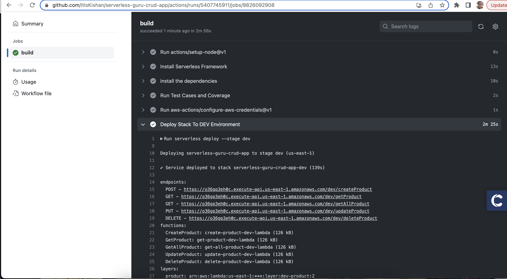
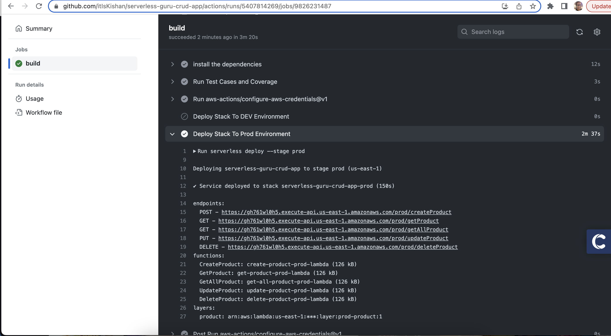

# CRUD APP USING SERVERLESS FRAMEWORK
This codebase showcases the creation of a CRUD app using the Serverless Framework. The app includes a table called ProductTable, which stores product data such as books, phones, clothes, and other products. Below is the schema for the table:
```
{
  "productId": "id",
  "productName": "string",
  "description": "string",
  "price":"string",
  "reviews":"string",
  "productType":"string",
  "totalAvailable":"string,
  "isDeleted":"string"
}
```
In addition to performing CRUD operations, this codebase includes the following Lambda functions for the CRUD app: createProduct, getProduct, getAllProduct, updateProduct, and deleteProduct.

These Lambda functions handle the various operations related to creating, retrieving, updating, and deleting products in the ProductTable.

Furthermore, the codebase incorporates test cases written using the Jest testing framework. All the test cases are located in the tests folder, allowing for comprehensive testing and ensuring the functionality and correctness of the implemented features.

By including tests, this codebase promotes robustness and reliability by verifying the behavior of the Lambda functions and ensuring they meet the desired requirements.

## Usage

### PREREQUISITES
I hope you have installed serverless framework, if not run the below command
```
npm i -g serverless
```

In Order To use the codebase you need to clone it.

```
$ git clone git@github.com:itIsKishan/serverless-guru-crud-project.git
```

After cloning, you should install the dependencies by running

```
npm install
```

### Folder Structure
Below is the Folder structure of the codebase:
```
├── README.md
├── __tests__  #test cases for all CRUD lambda
│   ├── createProduct.spec.js
│   ├── deleteProduct.spec.js
│   ├── getAllProduct.spec.js
│   ├── getProduct.spec.js
│   └── updateProduct.spec.js
├── resources
│   ├── lambda #lambda infra defined with permission, events and other things
│   │   ├── createProductLambda.yml
│   │   ├── deleteProductLambda.yml
│   │   ├── getAllProductsLambda.yml
│   │   ├── getProductLambda.yml
│   │   └── updateProductLambda.yml
│   └── tables  #table infra is created with HASH, RANGE and GSI
│       └── productTable.yml
├── serverless.yml
└── src
    └── lambdas #lambda logic to do CRUD operation
        ├── createProduct
        ├── deleteProduct
        ├── getAllProduct
        ├── getProduct
        └── updateProduct
```

### Deploy The App
To deploy this project you can run the below commands:

```
serverless deploy --stage dev
```
This will deploy the application to DEV environment

To deploy to PROD environment run the bellow command:

```
serverless deploy --stage prod
```

### API URL
If you want to use my API and test in postman use the below API:

```
DEV: https://jpj5e9tczb.execute-api.us-east-1.amazonaws.com/dev/
PROD: https://957o0k4up4.execute-api.us-east-1.amazonaws.com/prod/
```

### RUN TEST CASES

You can see the test cases coverage report by running this command:

```
npm test
```

which should look like below:


### BELOW ARE THE SCREENSHOT OF SUCCESSFUL DEPLOYMENT OF DEV & PROD USING GITHUB ACTIONS

DEV CI/CD pipeline


PROD CI/CD pipeline
